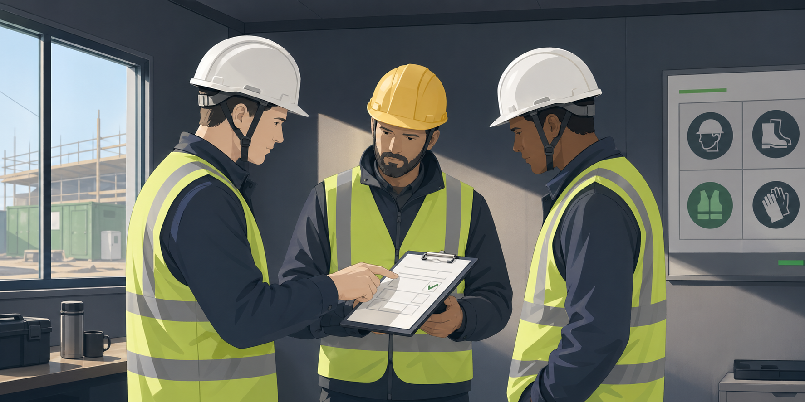
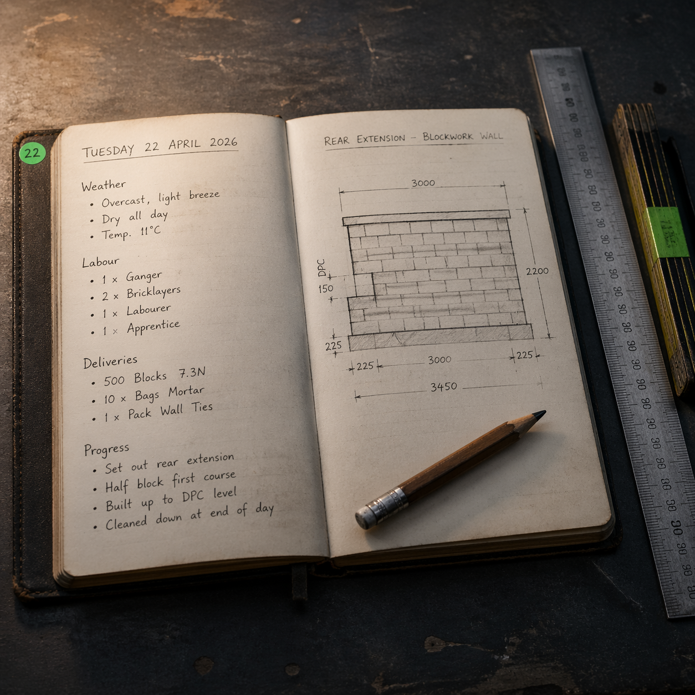
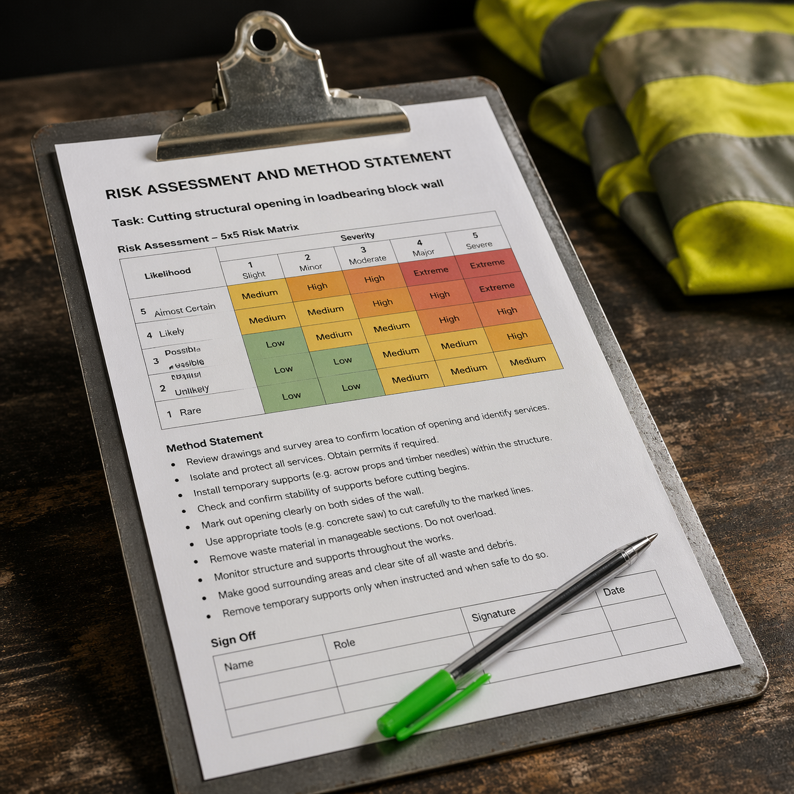
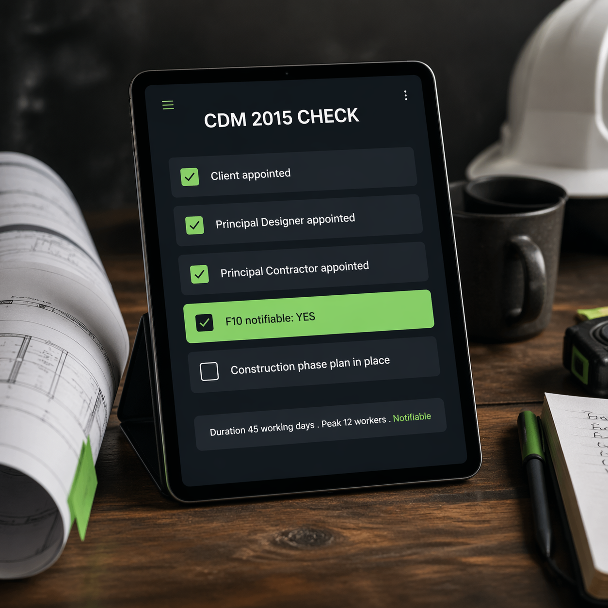
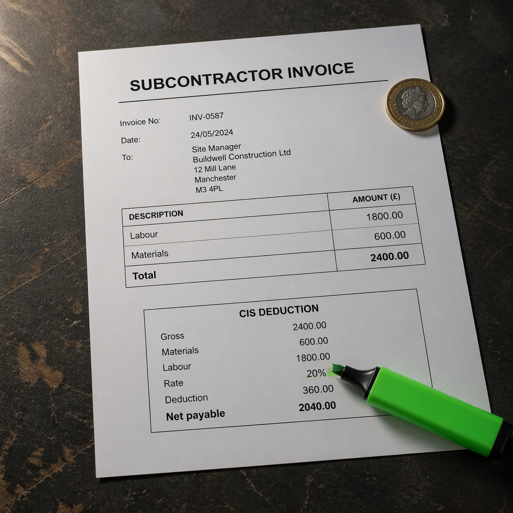
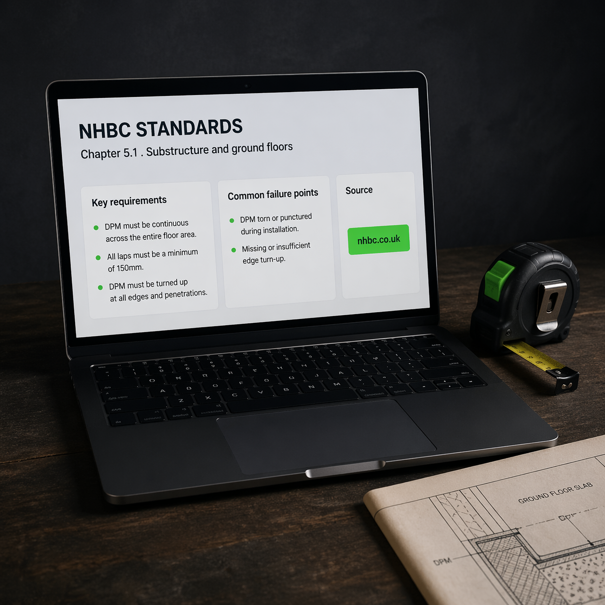

# ConstructionX Skills, UK Construction Claude Pack

ConstructionX AI is a Norfolk-based AI automation partner for small UK construction firms, founded by Jody Murfit after 30+ years in construction. This pack is a set of Claude Code skills written for how UK builders actually work. Site diaries, RAMS, CDM 2015, CIS, NHBC, toolbox talks. UK regs, UK conventions, UK language. Free, MIT, use them as you like.

<p align="center">
  
</p>

<p align="center">
  
  
  
  
  
</p>

## Install

Inside Claude Code, add the marketplace:

```
/plugin marketplace add Jody09-dotcom/constructionx-skills
```

Then install any skill from the pack:

```
/plugin install site-diary@constructionx-skills
/plugin install rams-generator@constructionx-skills
/plugin install cdm-2015-check@constructionx-skills
/plugin install cis-verification@constructionx-skills
/plugin install nhbc-lookup@constructionx-skills
/plugin install toolbox-talk-generator@constructionx-skills
```

## Skills Included

| | Skill | What it does | Example trigger |
|---|-------|--------------|-----------------|
|  | **site-diary** | Generates a daily UK construction site diary from a brief site-manager input. | "Write up the site diary for today, Norfolk, 3 bricklayers, rain am, blockwork 1st lift complete." |
|  | **rams-generator** | Drafts a UK RAMS (Risk Assessment and Method Statement) for a task. 5x5 risk matrix, hierarchy of control, PPE, sign-off block. | "Draft a RAMS for cutting a structural opening in a loadbearing block wall, two operatives, dust extraction." |
|  | **cdm-2015-check** | Checks a project against CDM 2015 duty-holder requirements and works out F10 notifiability. | "Is this project notifiable? 45 working days, peak 12 workers, commercial client, new office fit-out." |
|  | **cis-verification** | Walks a contractor through HMRC CIS verification and calculates the correct deduction. 0/20/30% logic, materials exemption, CIS300 reminder. | "I have a subbie invoice for 2,400 pounds including 600 materials, verify them and work out the deduction." |
|  | **nhbc-lookup** | Looks up NHBC Standards chapter requirements for a build element. Returns chapter pointer, key requirements, common failure points, official URL. | "What does NHBC say about ground-bearing slab DPM installation?" |
|  | **toolbox-talk-generator** | Generates a 5-minute UK construction toolbox talk from a one-line risk topic. Real site examples, one question for the team, one specific "do this today" instruction, foreman sign-off block. | "Draft a toolbox talk on working at height for tomorrow morning's brief." |

## Who This Is For

- UK site managers and project managers
- Small and medium builders, main contractors, SME firms
- Trades looking after their own compliance paperwork
- Construction admin teams drafting documents for review
- Anyone who needs a solid first-draft UK construction document without staring at a blank page

## Disclaimer

These skills produce drafts. They are not legal advice, tax advice, or formal compliance documents.

- RAMS must be reviewed, approved, and signed off by a competent person before use on site.
- CDM 2015 output is advisory. HSE is the authoritative source. Engage a qualified CDM coordinator or chartered construction professional for formal compliance.
- CIS output is not tax advice. Verify all rates and deductions with a qualified accountant. HMRC rules change.
- NHBC output is a summary only. Full NHBC Standards are copyright NHBC and available to subscribers at nhbc.co.uk. Always check the current edition.
- Site diaries are drafts. The site manager or PM must review, sign, and file before they become a formal record.
- Toolbox talks are drafts. The foreman or site manager delivers and signs them on the day. The skill does not replace a RAMS or formal HSE compliance.

Use the skills as a time-saver for first drafts. Keep the competent person in the loop.

## About ConstructionX AI

ConstructionX AI builds bespoke AI automation systems for small UK construction firms. Craft 1st. Tech 2nd. People ALWAYS.

Our main service is the **Opportunity Map**, a paid 45-minute working session that audits your business across 9 areas and maps every automation opportunity, scored by value impact and ranked by what to build first. If these free skills are useful to you, the Opportunity Map is where the full picture lives.

More at [constructionx.ai](https://constructionx.ai).

## Licence

MIT. See [LICENSE](LICENSE).
